# PressPlot

**PressPlot** (formerly PlotTheme) 是一个专注于出版级质量的 Matplotlib 绘图主题库。

它内置了精心设计的风格（如 "clean_modern"），旨在帮助科研人员和开发者用最少的代码绘制出美观、专业、符合顶级期刊标准的图表。

## 核心功能

- **出版级预设 (Publication-Ready Themes)**: 内置 "clean_modern" 等经过细致打磨的风格，开箱即用。
- **一键美化**: 简单的 API 即可让图表焕然一新。
- **风格管理**: 支持自定义和注册新的绘图风格。
- **实用工具**: 提供添加边框、行内标注等辅助功能，完善绘图工作流。

## Gallery

以下是使用 PressPlot 复刻的经典图表案例：

### 1. Political & Social Issues

| Government Shutdown Blame | Support for Political Violence |
|:---:|:---:|
| 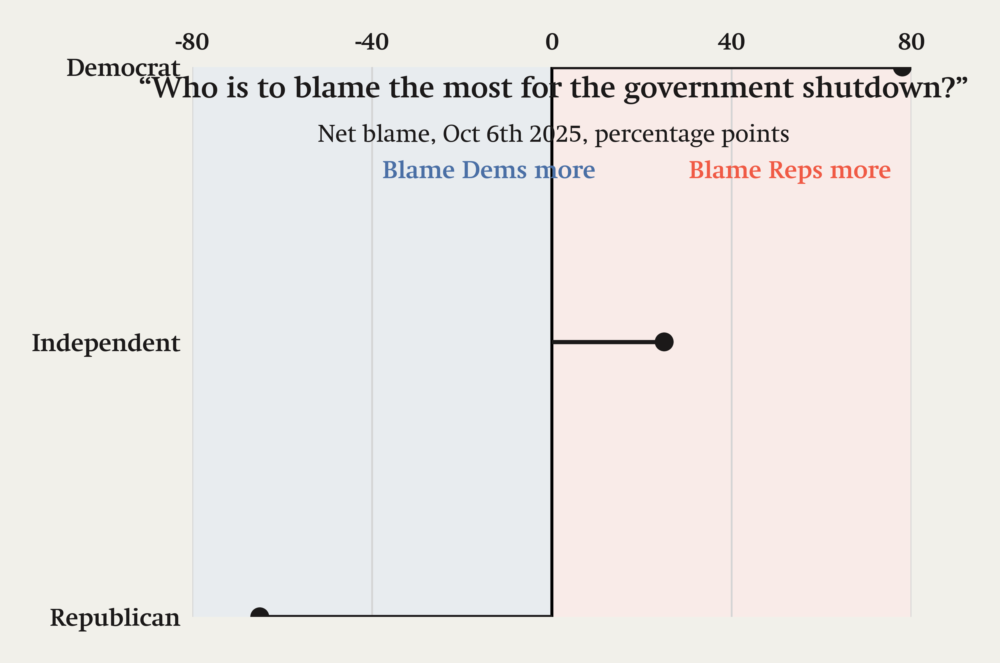 | 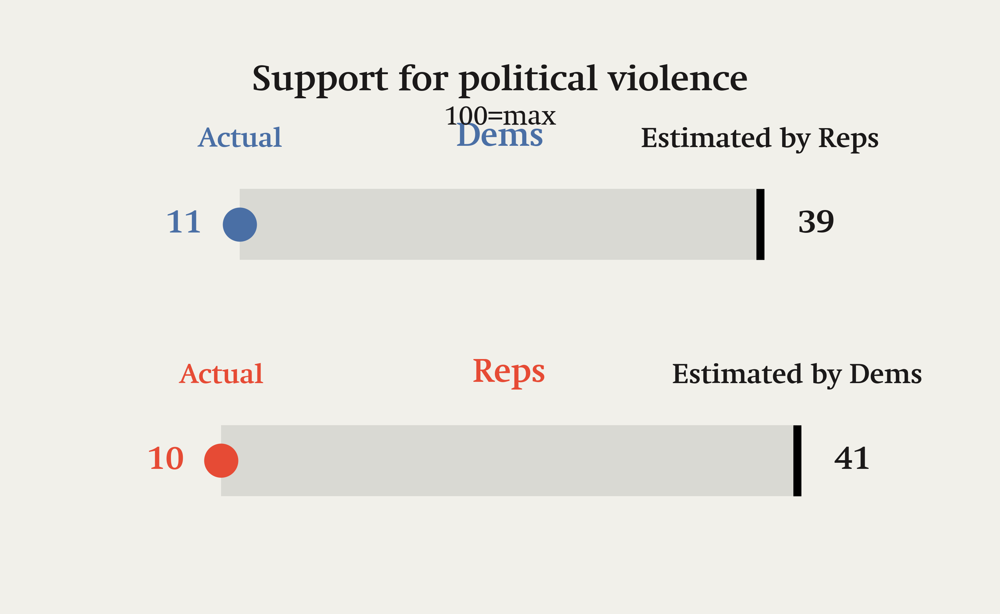 |

| Nobel Laureates | Passport Issuance |
|:---:|:---:|
| 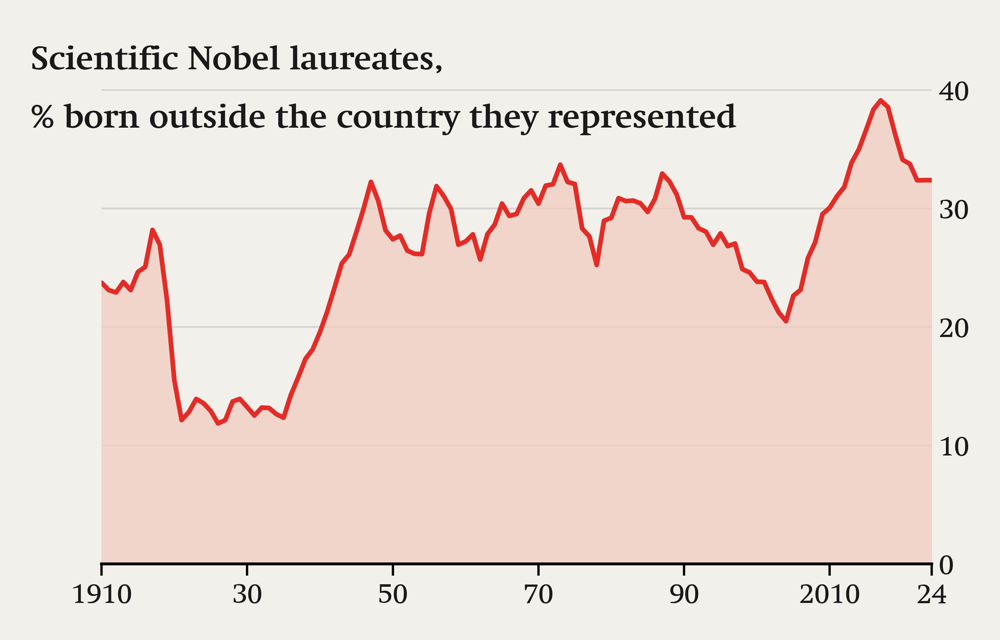 | 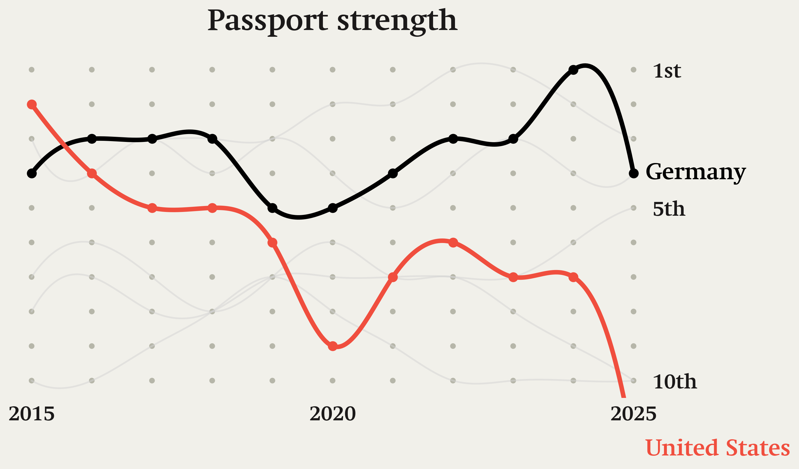 |

### 2. Economics & Policy

| One Big Beautiful Bill Act | Manufacturing Output |
|:---:|:---:|
| 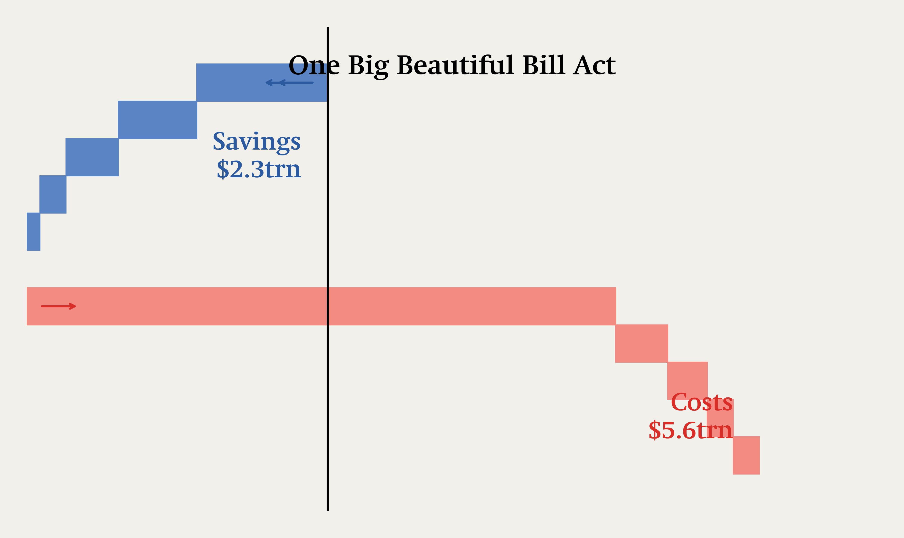 | 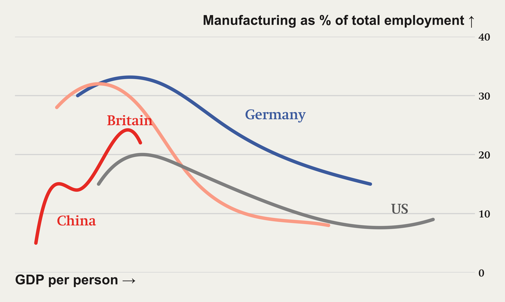 |

| Tariff Impact | Tech Stocks |
|:---:|:---:|
| 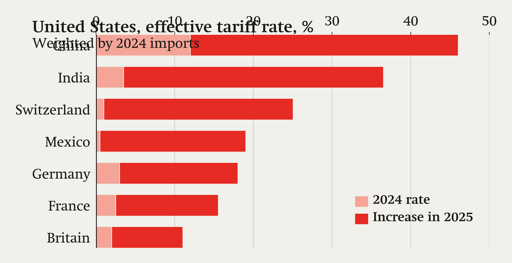 | 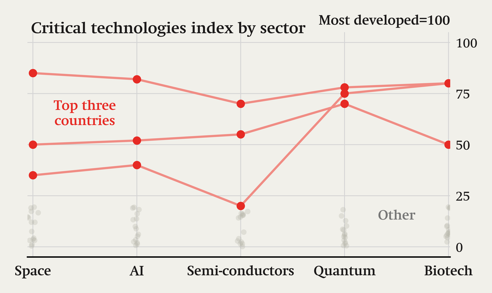 |

### 3. Maps & Demographics

| Greenland | World Map (Obesity Rates) |
|:---:|:---:|
| 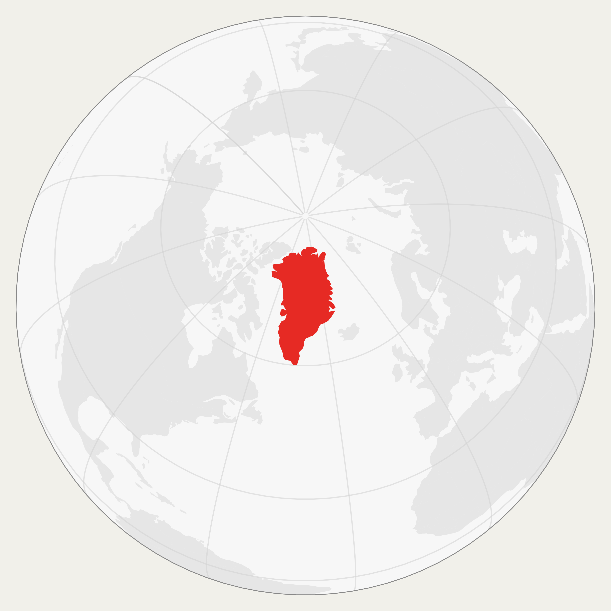 | 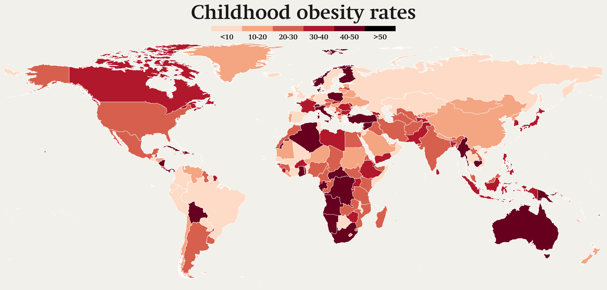 |

| French Children Maths Performance | Drinking Habits |
|:---:|:---:|
| 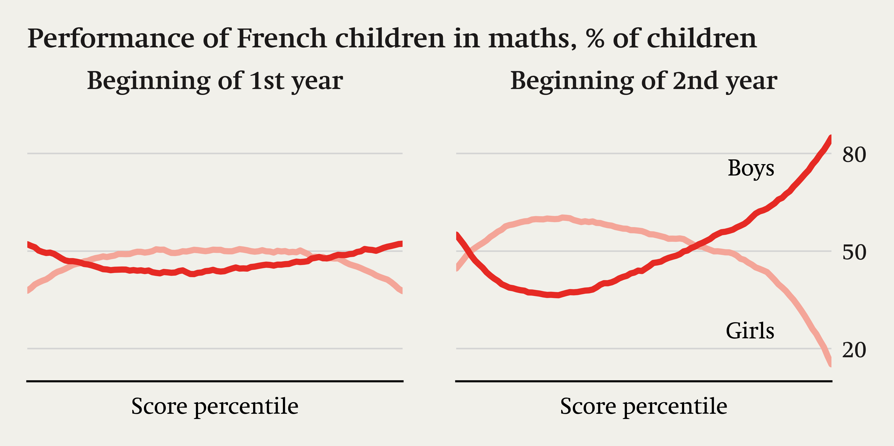 | 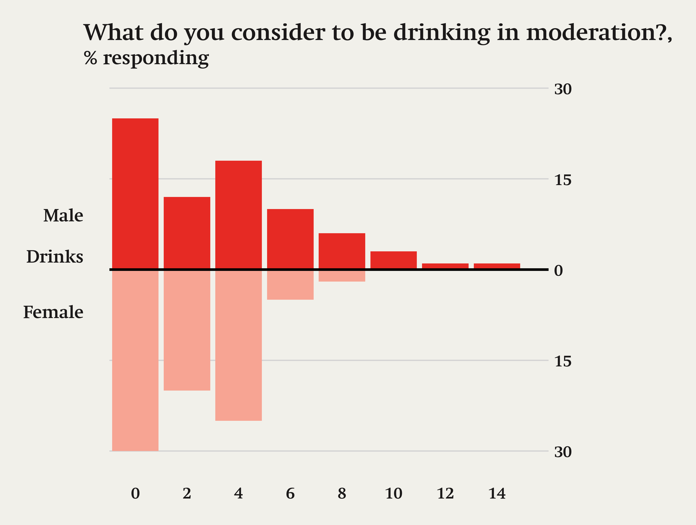 |

### 4. Social Media & Tech

| TikTok Usage | Bubble Chart Example |
|:---:|:---:|
| 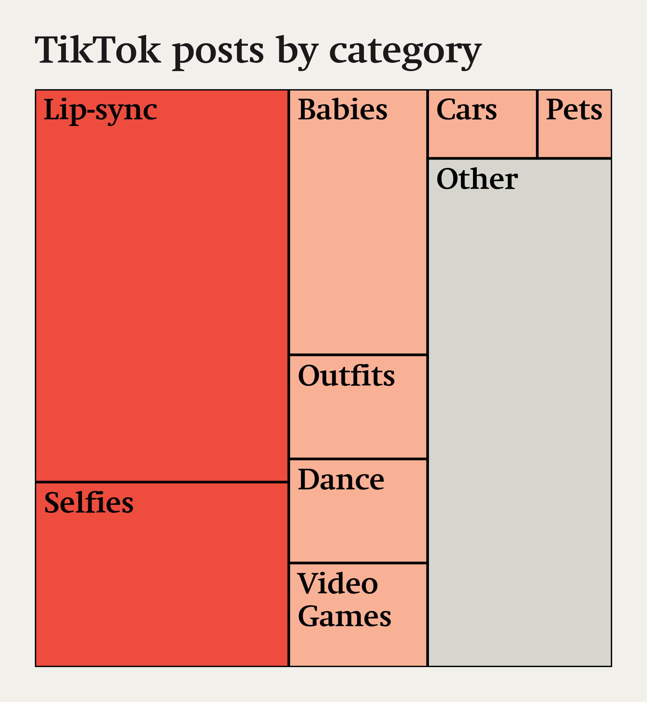 | 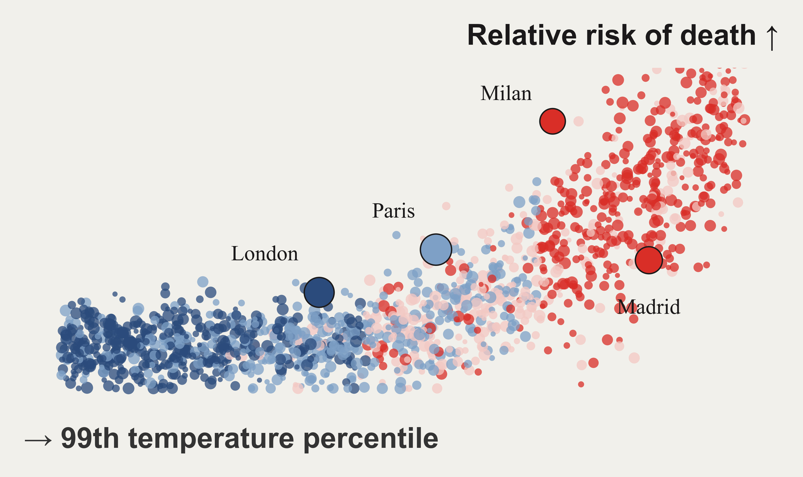 |

### 5. Basic Demos

| Scatter Plot | Theme Overview |
|:---:|:---:|
| 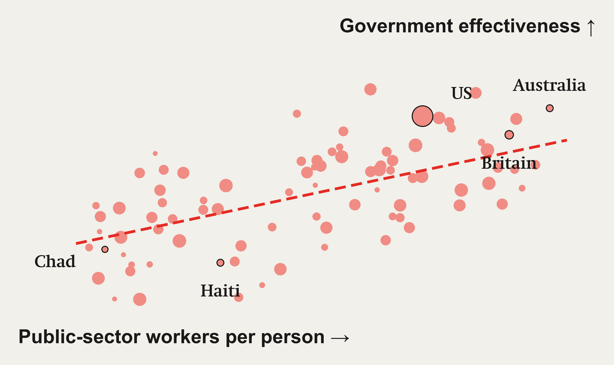 | 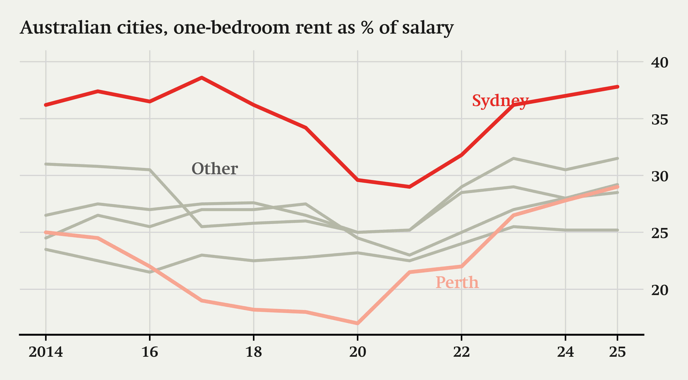 |

## 安装

```bash
pip install .
```

## 使用指南

### 1. 使用内置风格 (Clean Modern 风格)

```python
import matplotlib.pyplot as plt
import pressplot
import numpy as np

# 1. 加载 Clean Modern 风格
pressplot.load_theme("clean_modern")

# 2. 绘图
x = np.linspace(0, 10, 100)
y1 = np.sin(x)
y2 = np.cos(x)

fig, ax = plt.subplots(figsize=(8, 5))
line1, = ax.plot(x, y1, label='Sine')
line2, = ax.plot(x, y2, label='Cosine')

# 3. 使用辅助函数添加行内标注 (Line Annotation)
pressplot.label_line(ax, line1, "Sine Wave", x=8)
pressplot.label_line(ax, line2, "Cosine Wave", x=2)

ax.set_title("Trigonometric Functions", loc='left')
plt.show()
```

### 2. 定义和注册自定义主题

你可以通过代码动态注册一个主题：

```python
import pressplot

# 定义主题参数
my_rc_params = {
    "font.family": "sans-serif",
    "axes.titlesize": 18,
    "axes.labelsize": 14,
    "lines.linewidth": 2.5
}

# 定义配色方案 (可选)
my_palette = ["#E63946", "#F1FAEE", "#A8DADC", "#457B9D", "#1D3557"]

# 注册主题
pressplot.register_theme("my_custom_style", my_rc_params, palette=my_palette)

# 应用
pressplot.load_theme("my_custom_style")
```

## API 参考

- `pressplot.load_theme(name)`: 应用指定名称的主题。
- `pressplot.register_theme(name, rc_params, palette)`: 注册新主题。
- `pressplot.list_themes()`: 列出所有可用主题。
- `pressplot.label_line(ax, line, label, ...)`: 在折线上添加彩色文本标注。
- `pressplot.add_border(input_path, output_path, ...)`: 为图片添加出版级边框。
